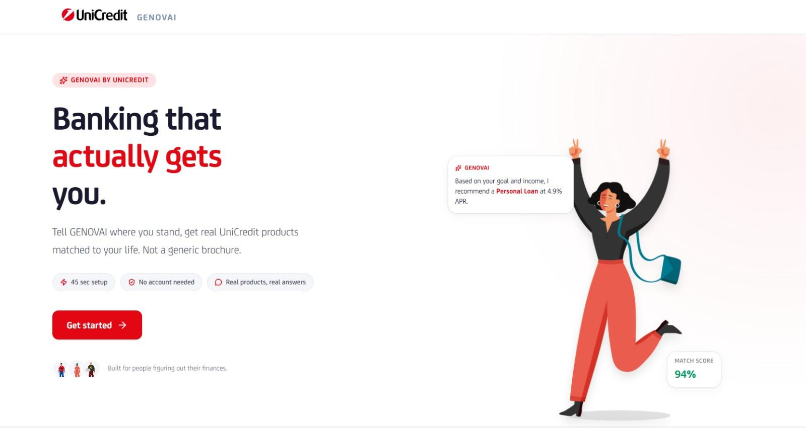
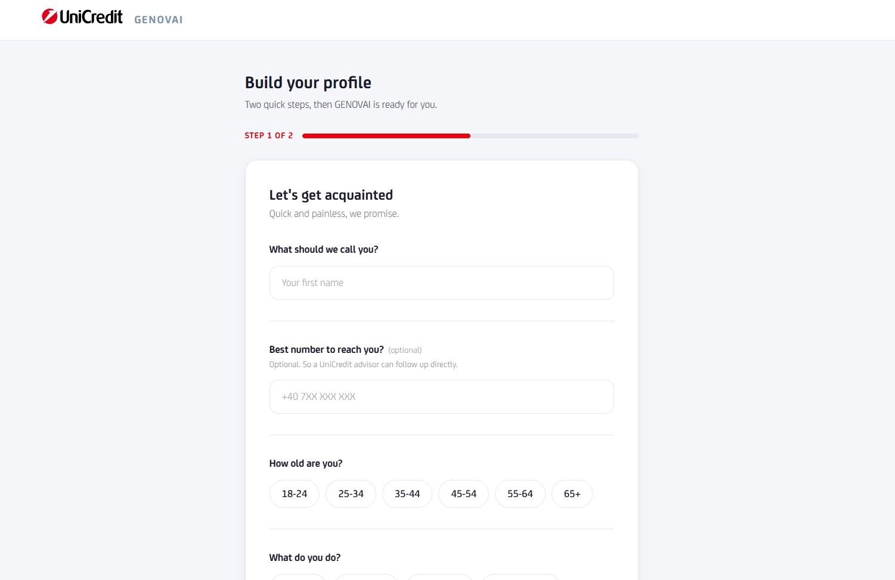
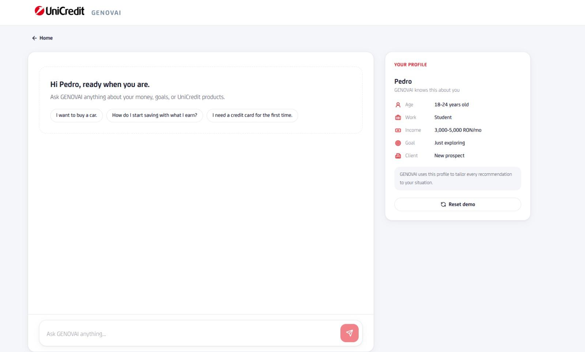
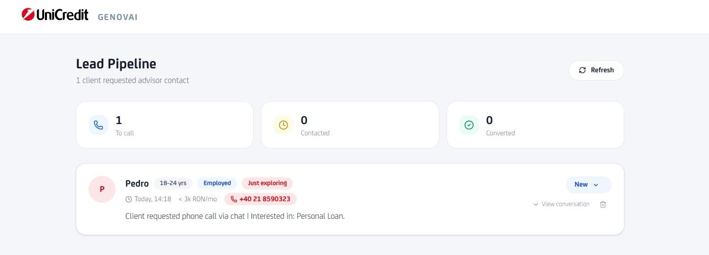

# GENOVAI — AI Financial Coach for UniCredit

Built in 48 hours for the **UniCredit Fintech Hackathon** (May 15–16, 2026) — 🥉 3rd place.

GENOVAI is a web prototype that helps UniCredit acquire and convert young customers. Instead of a generic product brochure, it profiles the visitor in about a minute, then lets an AI advisor chat through their financial goals and recommend the specific UniCredit products that actually fit — with a human advisor pulled in automatically when the conversation calls for it.

## Table of Contents

- [How it works](#how-it-works)
- [Brand fidelity](#brand-fidelity)
- [Screenshots](#screenshots)
- [Architecture](#architecture)
- [Tech stack](#tech-stack)
- [Getting started](#getting-started)
- [Project structure](#project-structure)
- [API reference](#api-reference)
- [Team](#team)

## How it works

1. **Profile** — a two-step onboarding form collects name, contact, and a 9-question suitability questionnaire modeled on **MiFID II** categories (investment objective, reaction to loss, time horizon, financial knowledge, savings rate, emergency fund, loss tolerance, return expectations, ESG preference).
2. **Score** — answers are turned deterministically into a risk/horizon/liquidity score, a sophistication level, and an ESG level, which classify the client into one of four segments: `CONSERVATIVE`, `BALANCED`, `GROWTH`, `AGGRESSIVE`. Safety overrides apply automatically — e.g. no emergency fund forces a conservative segment regardless of the raw score.
3. **Chat** — the visitor talks to GENOVAI, an AI assistant (Claude Haiku) that only recommends products from a real UniCredit catalog, pre-filtered by the client's segment and sophistication. Every reply returns structured recommendations with a fit score, clickable follow-up options, and next-question suggestions.
4. **Convert** — when the conversation signals genuine interest (a specific product, a life event, a mortgage question, etc.), GENOVAI naturally offers a callback from a human advisor. Accepted leads are saved with a summary of the conversation and surfaced on an internal **Lead Pipeline** dashboard, where the sales team tracks each contact from *New* → *Contacted* → *Converted*.

## Brand fidelity

For a fintech prototype pitched at a real bank's judging panel, looking like a genuine UniCredit product mattered as much as the AI logic. Rather than approximating the brand with a generic sans-serif and a red accent color, we pulled the actual UniCredit design system into the app:

- **Official typeface, self-hosted.** The real UniCredit Latin and Cyrillic webfonts (regular, light, medium, bold, heavy) are loaded via `@font-face` and set as the app's default font, not a look-alike Google Font.
- **Exact brand palette.** Colors are the official UniCredit red (`#e30613`) and navy, taken directly from the brand guidelines rather than eyeballed from screenshots.
- **Real logo, pixel-aligned.** The `UC_LOGO.svg` mark is baseline-aligned with the GENOVAI wordmark down to the pixel, so the lockup reads as one coherent identity instead of a logo pasted next to a product name.
- **Official iconography.** The homepage feature cards use UniCredit's own ESG icon set instead of generic stock icons.
- **On-brand motion.** Even the chat loading state is a small animated arc that echoes the shape of the UniCredit logo mark.

The goal was to make GENOVAI feel like something UniCredit could ship tomorrow, not a hackathon mockup wearing UniCredit's colors — which is also why every screen carries a visible "demonstration project" disclaimer.

## Screenshots

| Landing page | Onboarding |
|---|---|
|  |  |

| AI chat | Lead pipeline (admin) |
|---|---|
|  |  |

## Architecture

```
┌──────────────────────────────┐
│   FRONTEND (Next.js 16)      │
│   Onboarding · Chat UI       │
│   Admin lead dashboard       │
└───────────────┬───────────────┘
                │ REST (/api)
┌───────────────▼───────────────┐
│   BACKEND (Express 5 + TS)    │
│   /api/chat   → RAG prompt    │
│   /api/leads  → lead capture  │
└───────┬───────────────┬───────┘
        │               │
┌───────▼──────┐ ┌───────▼────────┐
│ Claude Haiku │ │ SQLite (leads) │
│ (Anthropic)  │ │ better-sqlite3 │
└──────────────┘ └────────────────┘
```

The backend pre-filters the UniCredit product catalog by the client's segment and sophistication before it ever reaches the model, then asks Claude to return strict JSON: advice text, ranked recommendations, clickable options, follow-up questions, and an `suggest_advisor` flag used to trigger lead capture.

## Tech stack

| Layer | Technology |
|---|---|
| Frontend | Next.js 16, React 19, Tailwind CSS 4 |
| Backend | Node.js, Express 5, TypeScript |
| AI | Anthropic Claude (Haiku) via `@anthropic-ai/sdk` |
| Storage | SQLite (`better-sqlite3`) for captured leads |
| Infra | Docker Compose (frontend + backend containers) |

## Getting started

### Option A — Docker Compose

```bash
cp .env.example .env          # add your ANTHROPIC_API_KEY
docker compose up --build
```

- Frontend: http://localhost:3000
- Backend: http://localhost:3001

### Option B — Run locally

**Backend**

```bash
cd backend
cp .env.example .env          # add your ANTHROPIC_API_KEY
npm install
npm run dev                   # http://localhost:3001
```

**Frontend**

```bash
cd frontend
npm install
npm run dev                   # http://localhost:3000
```

### Environment variables

| Variable | Where | Description |
|---|---|---|
| `ANTHROPIC_API_KEY` | backend | Claude API key used for the chat/RAG logic |
| `ADMIN_PASSWORD` | backend | Protects the `/api/leads` admin endpoints and dashboard |
| `FRONTEND_URL` | backend | Allowed CORS origin |
| `NEXT_PUBLIC_COACH_API_URL` | frontend | Backend chat endpoint the frontend calls |

## Project structure

```
unicredit-hackaton/
├── backend/
│   └── src/
│       ├── server.ts              # Express entry point
│       ├── routes/
│       │   ├── chatRoutes.ts      # POST /api/chat
│       │   └── leadRoutes.ts      # Lead capture + admin endpoints
│       ├── services/
│       │   ├── geminiService.ts   # Claude prompt + RAG logic
│       │   ├── database.ts        # SQLite setup/migrations
│       │   └── leadRepository.ts  # Lead persistence
│       └── data/
│           ├── products.json      # UniCredit product catalog
│           └── branches.json      # Branch info
│
├── frontend/
│   ├── app/
│   │   ├── page.tsx               # Landing page
│   │   ├── onboarding/            # Profiling flow
│   │   ├── chat/[id]/             # Chat with GENOVAI
│   │   └── admin/leads/           # Lead pipeline dashboard
│   ├── components/
│   │   ├── chat/                  # Chat UI (bubbles, composer, product cards)
│   │   ├── onboarding/            # Onboarding form
│   │   └── ui/                    # Shared UI (header, logo, button)
│   └── lib/
│       ├── onboardingQuestions.ts # MiFID II-style question bank
│       └── profilingService.ts    # Deterministic scoring logic
│
├── context/                       # Planning docs written during the hackathon
└── docker-compose.yml
```

## API reference

### `POST /api/chat`

```json
{
  "message": "I want to save for a trip",
  "clientProfile": { "...": "UserProfile from onboarding" },
  "conversationHistory": [{ "role": "user", "content": "..." }]
}
```

Returns advice text, ranked product recommendations with fit scores, clickable options, follow-up questions, and whether the conversation should be handed off to a human advisor.

### `POST /api/leads`

Saves a qualified lead (name, phone, segment, ESG level, conversation summary, advisor reason) once the client accepts a callback offer.

### `GET /api/leads` · `PATCH /api/leads/:id`

Admin-only (requires `x-admin-password` header). Lists captured leads and updates their status (`new`, `contacted`, `converted`, `dismissed`) for the Lead Pipeline dashboard.

## Team

Built by Xurxo and [Pedro Medina](https://github.com/pedromedinatech) during the UniCredit Fintech Hackathon.

---

*Demonstration project — not affiliated with UniCredit S.p.A. Product names are referenced for educational purposes only.*
